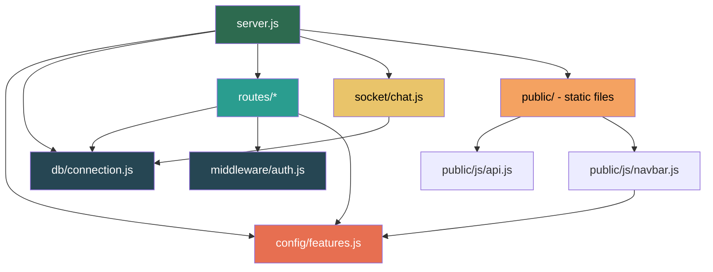

<](https://nodejs.org/)
[](https://expressjs.com/)
[](https://www.mysql.com/)
[](https://socket.io/)
[](https://opensource.org/licenses/ISC)

</div>

---

## 📑 Table of Contents

- [Overview](#-overview)
- [Key Features](#-key-features)
- [Tech Stack](#-tech-stack)
- [Project Structure](#-project-structure)
  - [Folder Tree](#folder-tree)
  - [Root Files](#root-files)
  - [config/](#config--feature-flag-system)
  - [db/](#db--database-layer)
  - [middleware/](#middleware--request-guards)
  - [routes/](#routes--api-endpoints)
  - [socket/](#socket--real-time-communication)
  - [public/](#public--frontend-application)
  - [tests/](#tests--automated-testing)
- [Directory Dependency Map](#-directory-dependency-map)
- [Database Schema](#-database-schema)
- [API Reference](#-api-reference)
- [Feature Flags](#-feature-flags)
- [Getting Started](#-getting-started)
  - [Prerequisites](#prerequisites)
  - [Installation](#installation)
  - [Environment Variables](#environment-variables)
  - [Running the Server](#running-the-server)
  - [Running Tests](#running-tests)
- [Workflow & Usage Tips](#-workflow--usage-tips)
- [Contributing](#-contributing)
- [License](#-license)

---

## 🌟 Overview

**Skill Swap** is a full-stack web application that enables users to exchange skills through a peer-to-peer marketplace. Users can list skills they want to **teach** or **learn**, send swap requests, chat in real time, schedule sessions, and — optionally — pay for premium learning sessions. A built-in review and reputation system helps learners find the best mentors.

The platform is designed as a **modular, feature-flagged** application: optional modules like paid learning, video meetings, and the review system can be toggled on/off without touching the core swap functionality.

---

## ✨ Key Features

| Category | Features |
|---|---|
| **Core** | User registration & login, skill listing (teach/learn), swap request lifecycle, real-time chat (Socket.IO), session scheduling, smart recommendations |
| **Paid Learning** *(optional)* | Instructors can set per-session prices, demo payment flow, earnings dashboard |
| **Reviews & Reputation** *(optional)* | 1-5 star reviews, mentor reputation score (weighted algorithm), featured testimonials, leaderboard |
| **Video Meetings** *(optional)* | Attach external meeting links (Zoom, Google Meet, etc.) to sessions |
| **Frontend** | 12-page responsive UI, glassmorphism design, dark/light theme toggle, toast notifications, skeleton loading states |

---

## 🛠 Tech Stack

| Layer | Technology |
|---|---|
| **Runtime** | Node.js 18+ |
| **Framework** | Express 4.21 |
| **Database** | MySQL 8.0 (via `mysql2`) |
| **Real-time** | Socket.IO 4.7 |
| **Auth** | Express Sessions + bcrypt |
| **Frontend** | Vanilla HTML / CSS / JavaScript |
| **Testing** | Node.js built-in test runner (`node:test`) |

---

## 🗂 Project Structure

### Folder Tree

```
Swap-Skills/
├── config/
│   └── features.js              # Feature flag system (toggle optional modules)
├── db/
│   ├── connection.js            # MySQL pool, auto-create DB & tables, migrations
│   └── schema.sql               # Reference SQL schema (human-readable)
├── middleware/
│   └── auth.js                  # Session-based authentication guard
├── public/                      # Static frontend (served by Express)
│   ├── css/
│   │   └── styles.css           # Complete design system (light/dark themes)
│   ├── js/
│   │   ├── api.js               # Fetch wrapper & auth helpers
│   │   ├── navbar.js            # Dynamic navbar/footer injection
│   │   ├── theme.js             # Light/dark theme toggle (localStorage)
│   │   └── utils.js             # Toast, skeleton, date formatting, debounce
│   ├── index.html               # Landing / home page
│   ├── login.html               # Login form
│   ├── register.html            # Registration form
│   ├── dashboard.html           # User dashboard (stats, recommendations)
│   ├── profile.html             # User profile editor
│   ├── skills.html              # Browse, search & manage skills
│   ├── requests.html            # View & manage swap requests
│   ├── chat.html                # Real-time messaging (Socket.IO)
│   ├── sessions.html            # Schedule & manage learning sessions
│   ├── payment.html             # Demo payment flow
│   ├── earnings.html            # Instructor earnings dashboard
│   └── mentor-profile.html      # Public mentor profile with reviews
├── routes/                      # Express route modules (REST API)
│   ├── auth.js                  # Register, login, logout, current user
│   ├── users.js                 # User profiles (list, get, update)
│   ├── skills.js                # Skills CRUD + trending + search
│   ├── requests.js              # Swap request lifecycle (send/accept/reject/delete)
│   ├── messages.js              # Chat messages (CRUD, search, paid-chat support)
│   ├── sessions.js              # Learning sessions (swap & paid types)
│   ├── recommendations.js       # Smart skill & user recommendations
│   ├── payments.js              # Demo payment create/verify/history/earnings
│   ├── reviews.js               # Review CRUD + mentor stats recalculation
│   ├── reputation.js            # Reputation score breakdown & leaderboard
│   └── testimonials.js          # Featured testimonial management
├── socket/
│   └── chat.js                  # Socket.IO event handlers (messaging, typing)
├── tests/
│   └── api.test.js              # 22 integration tests (Node.js test runner)
├── server.js                    # Application entry point
├── package.json                 # Project metadata & dependencies
├── package-lock.json            # Locked dependency versions
└── .gitignore                   # Git ignore rules
```

---

### Root Files

| File | Purpose |
|---|---|
| `server.js` | **Application entry point.** Configures Express middleware (CORS, JSON, sessions), mounts all API routes under `/api/*`, initializes Socket.IO, serves the `public/` directory as static files, and starts the HTTP server on the configured port. |
| `package.json` | Project metadata, npm scripts (`start`, `dev`, `test`), and production dependencies. |
| `package-lock.json` | Deterministic dependency tree for reproducible installs. |
| `.gitignore` | Excludes `node_modules/`, `.env`, and `*.log` from version control. |

---

### `config/` — Feature Flag System

> **Purpose:** Toggle optional platform modules on/off without code changes.

| File | Description |
|---|---|
| `features.js` | Exports a `features` object with boolean flags (`PAID_LEARNING`, `VIDEO_MEETINGS`, `MENTOR_DASHBOARD`, `REVIEWS_RATINGS`, `ADVANCED_ANALYTICS`). Also exports `isFeatureEnabled()` for runtime checks and `requireFeature()` as Express middleware to gate entire route groups. |

**Dependencies:** Used by `routes/payments.js`, `routes/reviews.js`, `routes/reputation.js`, `routes/testimonials.js`, `routes/messages.js`, `routes/sessions.js`, `routes/recommendations.js`, and `public/js/navbar.js`.

---

### `db/` — Database Layer

> **Purpose:** MySQL connection pool and automatic database/table initialization.

| File | Description |
|---|---|
| `connection.js` | Creates two MySQL connection pools (one for DB creation, one for application use). The `initializeDatabase()` function auto-creates the database, all 8 tables, and runs safe `ALTER TABLE` migrations on startup. Exports a promise-based pool for all queries. |
| `schema.sql` | Human-readable reference SQL schema with `CREATE TABLE` statements and performance indexes. Useful for manual DB setup or documentation — the app auto-creates tables via `connection.js`. |

**Dependencies:** Imported by every `routes/*.js` module and `socket/chat.js` for database queries.

---

### `middleware/` — Request Guards

> **Purpose:** Reusable Express middleware for route protection.

| File | Description |
|---|---|
| `auth.js` | Exports `isAuthenticated` — checks `req.session.userId` and returns `401` if not logged in. Applied to all protected API endpoints. |

**Dependencies:** Used by `routes/users.js`, `routes/skills.js`, `routes/requests.js`, `routes/messages.js`, `routes/sessions.js`, `routes/payments.js`, `routes/reviews.js`, `routes/testimonials.js`.

---

### `routes/` — API Endpoints

> **Purpose:** Modular Express routers implementing the full REST API. Each file handles one domain.

| File | Domain | Key Endpoints | Auth Required | Feature-Gated |
|---|---|---|---|---|
| `auth.js` | Authentication | `POST register`, `POST login`, `POST logout`, `GET me` | Partial | No |
| `users.js` | User Profiles | `GET /` (list/search), `GET /:id`, `PUT /:id` | Partial | No |
| `skills.js` | Skill Management | `POST /`, `GET /` (filter), `GET /trending`, `PUT /:id`, `DELETE /:id` | Partial | No |
| `requests.js` | Swap Requests | `POST /`, `GET /`, `PUT /:id/accept`, `PUT /:id/reject`, `DELETE /:id` | Yes | No |
| `messages.js` | Chat Messages | `GET /:requestId`, `GET /paid/:paymentId`, `DELETE /:id/message/:msgId`, `DELETE /:id/clear`, `GET /:id/search` | Yes | Partial |
| `sessions.js` | Learning Sessions | `POST /`, `GET /`, `PUT /:id`, `DELETE /:id`, `DELETE /paid/:paymentId` | Yes | Partial |
| `recommendations.js` | Smart Recommendations | `GET /` | Yes | Partial |
| `payments.js` | Payment Flow | `POST /create-order`, `POST /verify`, `GET /history`, `GET /earnings` | Yes | **PAID_LEARNING** |
| `reviews.js` | Review System | `POST /`, `GET /mentor/:id`, `GET /session/:id`, `DELETE /:id`, `PUT /:id/moderate` | Partial | **REVIEWS_RATINGS** |
| `reputation.js` | Reputation Scores | `GET /:userId`, `GET /leaderboard` | No | **REVIEWS_RATINGS** |
| `testimonials.js` | Featured Testimonials | `POST /`, `DELETE /:id`, `GET /mentor/:id`, `PUT /:id/priority` | Partial | **REVIEWS_RATINGS** |

**Dependencies:** All route files import `db/connection.js`. Most import `middleware/auth.js`. Feature-gated routes import `config/features.js`.

---

### `socket/` — Real-Time Communication

> **Purpose:** WebSocket event handlers for the live chat system.

| File | Description |
|---|---|
| `chat.js` | Handles Socket.IO events: `joinRoom` (enter a chat room per swap request), `sendMessage` (persist to DB + broadcast), `typing` / `stopTyping` indicators, and `disconnect`. Messages are stored in the `messages` table and broadcast to all room participants. |

**Dependencies:** Imports `db/connection.js`. Initialized by `server.js` which passes the `io` instance.

---

### `public/` — Frontend Application

> **Purpose:** Static HTML/CSS/JS frontend served by Express. Implements a responsive, glassmorphism-styled UI with light/dark theme support.

#### `public/css/`

| File | Description |
|---|---|
| `styles.css` | Complete design system (~58 KB). Includes CSS custom properties for theming, responsive layouts, glassmorphism card styles, button variants, form inputs, toast notifications, skeleton loaders, navbar, footer, and per-page component styles. |

#### `public/js/`

| File | Description |
|---|---|
| `api.js` | `fetch` wrapper (`apiRequest`) with auto-redirect to login on `401`. Exports convenience methods (`api.get`, `api.post`, `api.put`, `api.delete`) and auth helper `getCurrentUser()`. |
| `navbar.js` | Dynamically injects the navbar and footer into every page on `DOMContentLoaded`. Navbar links respond to feature flags (e.g., hides "Earnings" if `PAID_LEARNING` is off). Handles auth state display and logout. |
| `theme.js` | IIFE that restores the saved theme from `localStorage` on page load. Exports `toggleTheme()` to switch between `light` and `dark`. |
| `utils.js` | Shared utilities: `showToast()`, `showSkeleton()`, `validateForm()`, `validateEmail()`, `formatDate/Time()`, `timeAgo()`, `debounce()`. |

#### HTML Pages

| Page | Purpose |
|---|---|
| `index.html` | Landing page — hero section, feature highlights, CTA |
| `login.html` | Login form (email + password) |
| `register.html` | Registration form (username, email, password, full name) |
| `dashboard.html` | Authenticated user dashboard — stats, recommendations, activity |
| `profile.html` | Edit own profile (name, bio, avatar URL, location) |
| `skills.html` | Browse all skills with search/filter, add/edit own skills |
| `requests.html` | View incoming/outgoing swap requests, accept/reject |
| `chat.html` | Real-time messaging with Socket.IO (per swap request) |
| `sessions.html` | Schedule, view, and manage learning sessions |
| `payment.html` | Demo payment flow for paid learning sessions |
| `earnings.html` | Instructor earnings dashboard (total, monthly, recent transactions) |
| `mentor-profile.html` | Public mentor profile with reviews, reputation, testimonials |

---

### `tests/` — Automated Testing

> **Purpose:** Integration tests that validate the API end-to-end against a running server.

| File | Description |
|---|---|
| `api.test.js` | 22 sequential tests using Node.js built-in `node:test` runner. Covers: registration, duplicate prevention, login/logout, session persistence, skill CRUD, profile updates, recommendations, feature flags, paid learning endpoints, and session listing. Uses raw `http` requests with cookie-jar support. |

**Dependencies:** Requires a running server on `localhost:3000` with an active MySQL instance.

---

## 🔗 Directory Dependency Map



| Source | Depends On | Relationship |
|---|---|---|
| `server.js` | `config/`, `db/`, `routes/`, `socket/`, `public/` | Entry point — wires everything together |
| All `routes/*.js` | `db/connection.js` | Query the database |
| Most `routes/*.js` | `middleware/auth.js` | Protect authenticated endpoints |
| `routes/payments.js`, `reviews.js`, `reputation.js`, `testimonials.js` | `config/features.js` | Gate routes behind feature flags |
| `routes/messages.js`, `sessions.js`, `recommendations.js` | `config/features.js` | Conditional logic based on flags |
| `socket/chat.js` | `db/connection.js` | Persist and fetch messages |
| `public/js/navbar.js` | `/api/features` endpoint | Conditionally render navigation links |
| `public/js/api.js` | `/api/auth/me` | Check authentication state |
| `tests/api.test.js` | Running server + MySQL | End-to-end integration testing |

---

## 🗄 Database Schema

The application auto-creates the `skillswap` database and all tables on startup. Here are the 8 core tables:

| Table | Purpose | Key Relationships |
|---|---|---|
| `users` | User accounts (credentials, profile, reputation scores) | — |
| `skills` | Skills per user (`teach` or `learn`) with optional pricing | → `users` |
| `swap_requests` | Swap proposals between two users + their skills | → `users`, → `skills` |
| `messages` | Chat messages tied to a swap request (or paid session) | → `swap_requests`, → `users` |
| `sessions` | Scheduled learning sessions (swap or paid) | → `users`, → `swap_requests`, → `payments` |
| `payments` | Payment records for paid learning (demo mode) | → `users`, → `skills` |
| `reviews` | Session reviews with 1-5 star ratings | → `sessions`, → `users` |
| `testimonials` | Featured reviews selected by mentors | → `reviews`, → `users` |

---

## 📡 API Reference

All endpoints are prefixed with `/api`. Responses are JSON.

### Authentication

| Method | Endpoint | Description | Auth |
|---|---|---|---|
| `POST` | `/api/auth/register` | Create new user account | No |
| `POST` | `/api/auth/login` | Login with email & password | No |
| `POST` | `/api/auth/logout` | Destroy session | No |
| `GET` | `/api/auth/me` | Get current authenticated user | Yes |

### Users

| Method | Endpoint | Description | Auth |
|---|---|---|---|
| `GET` | `/api/users` | List users (optional `?search=`) | No |
| `GET` | `/api/users/:id` | Get user profile with skills + review count | No |
| `PUT` | `/api/users/:id` | Update own profile | Yes |

### Skills

| Method | Endpoint | Description | Auth |
|---|---|---|---|
| `POST` | `/api/skills` | Add a skill (teach or learn) | Yes |
| `GET` | `/api/skills` | List/search/filter skills (`?search=`, `?category=`, `?type=`, `?user_id=`) | No |
| `GET` | `/api/skills/trending` | Top 10 skills by request frequency | No |
| `PUT` | `/api/skills/:id` | Update own skill | Yes |
| `DELETE` | `/api/skills/:id` | Delete own skill | Yes |

### Swap Requests

| Method | Endpoint | Description | Auth |
|---|---|---|---|
| `POST` | `/api/requests` | Send a swap request | Yes |
| `GET` | `/api/requests` | List own sent & received requests | Yes |
| `PUT` | `/api/requests/:id/accept` | Accept a request (receiver only) | Yes |
| `PUT` | `/api/requests/:id/reject` | Reject a request (receiver only) | Yes |
| `DELETE` | `/api/requests/:id` | Soft-delete a swap conversation | Yes |

### Messages

| Method | Endpoint | Description | Auth |
|---|---|---|---|
| `GET` | `/api/messages/:requestId` | Chat history for an accepted swap | Yes |
| `GET` | `/api/messages/paid/:paymentId` | Chat for a paid session | Yes |
| `DELETE` | `/api/messages/:requestId/message/:messageId` | Delete own message | Yes |
| `DELETE` | `/api/messages/:requestId/clear` | Clear all messages in a conversation | Yes |
| `GET` | `/api/messages/:requestId/search?q=` | Search messages in a conversation | Yes |

### Sessions

| Method | Endpoint | Description | Auth |
|---|---|---|---|
| `POST` | `/api/sessions` | Create a session (swap or paid) | Yes |
| `GET` | `/api/sessions` | List own sessions | Yes |
| `PUT` | `/api/sessions/:id` | Update a session (host only) | Yes |
| `DELETE` | `/api/sessions/:id` | Cancel a session | Yes |
| `DELETE` | `/api/sessions/paid/:paymentId` | Remove a paid conversation | Yes |

### Recommendations

| Method | Endpoint | Description | Auth |
|---|---|---|---|
| `GET` | `/api/recommendations` | Get matched users, similar skills, trending, affordable skills, top instructors | Yes |

### Payments *(requires `PAID_LEARNING`)*

| Method | Endpoint | Description | Auth |
|---|---|---|---|
| `POST` | `/api/payments/create-order` | Create a simulated payment order | Yes |
| `POST` | `/api/payments/verify` | Verify/complete a payment (demo: always succeeds) | Yes |
| `GET` | `/api/payments/history` | Payment history as a payer | Yes |
| `GET` | `/api/payments/earnings` | Earnings summary as an instructor | Yes |

### Reviews *(requires `REVIEWS_RATINGS`)*

| Method | Endpoint | Description | Auth |
|---|---|---|---|
| `POST` | `/api/reviews` | Submit a review for a completed session | Yes |
| `GET` | `/api/reviews/mentor/:id` | Get paginated reviews for a mentor | No |
| `GET` | `/api/reviews/session/:id` | Get review for a specific session | Yes |
| `DELETE` | `/api/reviews/:id` | Delete own review | Yes |
| `PUT` | `/api/reviews/:id/moderate` | Approve/reject a review (admin) | Yes |

### Reputation *(requires `REVIEWS_RATINGS`)*

| Method | Endpoint | Description | Auth |
|---|---|---|---|
| `GET` | `/api/reputation/:userId` | Reputation score breakdown | No |
| `GET` | `/api/reputation/leaderboard` | Top mentors by reputation score | No |

### Testimonials *(requires `REVIEWS_RATINGS`)*

| Method | Endpoint | Description | Auth |
|---|---|---|---|
| `POST` | `/api/testimonials` | Feature a review as a testimonial | Yes |
| `DELETE` | `/api/testimonials/:id` | Unfeature a testimonial | Yes |
| `GET` | `/api/testimonials/mentor/:id` | Get featured testimonials for a mentor | No |
| `PUT` | `/api/testimonials/:id/priority` | Reorder testimonial display priority | Yes |

### Feature Flags

| Method | Endpoint | Description | Auth |
|---|---|---|---|
| `GET` | `/api/features` | Get current feature flag states | No |

---

## 🚩 Feature Flags

Feature flags are defined in `config/features.js` and control optional modules:

| Flag | Default | Controls |
|---|---|---|
| `PAID_LEARNING` | `true` | Payment routes, pricing on skills, earnings dashboard, paid chat |
| `VIDEO_MEETINGS` | `true` | Meeting link field on sessions |
| `MENTOR_DASHBOARD` | `true` | Earnings page visibility in navbar |
| `REVIEWS_RATINGS` | `true` | Reviews, testimonials, reputation system, mentor scores |
| `ADVANCED_ANALYTICS` | `false` | Admin analytics (future — not yet implemented) |

To toggle a feature, edit the boolean value in `config/features.js` and restart the server. The frontend fetches flags from `GET /api/features` to conditionally render UI elements.

---

## 🚀 Getting Started

### Prerequisites

| Software | Version | Purpose |
|---|---|---|
| [Node.js](https://nodejs.org/) | 18.0+ | JavaScript runtime |
| [MySQL](https://dev.mysql.com/downloads/) | 8.0+ | Relational database |
| npm | (bundled with Node.js) | Package manager |

### Installation

```bash
# 1. Clone the repository
git clone https://github.com/Ktripathi2611/Swap-Skills.git
cd Swap-Skills

# 2. Install dependencies
npm install
```

### Environment Variables

Create a `.env` file in the project root:

```env
# Database
DB_HOST=localhost
DB_PORT=3306
DB_USER=root
DB_PASSWORD=your_mysql_password
DB_NAME=skillswap

# Server
PORT=3000
SESSION_SECRET=your_unique_session_secret_here
```

> **Note:** The application will auto-create the `skillswap` database and all tables on first startup — no manual SQL setup required.

### Running the Server

```bash
# Production mode
npm start

# Development mode (auto-restarts on file changes)
npm run dev
```

Open [http://localhost:3000](http://localhost:3000) in your browser.

### Running Tests

> ⚠️ Tests require a running server and MySQL instance.

```bash
# Start the server in one terminal
npm run dev

# Run tests in another terminal
npm test
```

The test suite executes 22 sequential integration tests covering auth, skills, profiles, recommendations, feature flags, and payments.

---

## 💡 Workflow & Usage Tips

1. **First Run:** The server auto-creates the database, tables, and runs migrations — just configure `.env` and start.
2. **Feature Toggling:** Edit `config/features.js` booleans and restart. Both backend routes and frontend UI adapt automatically.
3. **Adding New Routes:** Create a new file in `routes/`, use `require('../db/connection')` for DB access, and mount it in `server.js` via `app.use('/api/yourroute', require('./routes/yourroute'))`.
4. **Frontend Pages:** Add a new `.html` file in `public/`. Include the shared scripts (`theme.js`, `api.js`, `utils.js`, `navbar.js`) for consistent theming, navigation, and API access.
5. **Real-Time Chat:** The chat system uses Socket.IO rooms keyed by swap request ID. To extend, add new events in `socket/chat.js`.
6. **Payments:** The current payment system is a **demo simulation** — no real payment gateway is integrated. Replace the logic in `routes/payments.js` with Razorpay/Stripe for production.
7. **Theming:** The CSS uses `data-theme` attributes on `<html>`. All color values use CSS custom properties — customize the palette in `public/css/styles.css`.

---

## 🤝 Contributing

### Getting Started

1. **Fork** the repository
2. **Create a feature branch:** `git checkout -b feature/your-feature-name`
3. **Make your changes** and test them
4. **Commit** with a descriptive message: `git commit -m "feat: add your feature"`
5. **Push** to your fork: `git push origin feature/your-feature-name`
6. **Open a Pull Request** against the `main` branch

### Code Guidelines

| Area | Guideline |
|---|---|
| **Routes** | One domain per file. Use `isAuthenticated` for protected endpoints. Use `requireFeature()` for optional modules. |
| **Database** | Add new tables/columns via the migration array in `db/connection.js` (never modify existing `CREATE TABLE` statements). |
| **Frontend** | Keep pages in `public/`. Use the shared `api.js` helpers for API calls. Follow the existing glassmorphism design patterns in `styles.css`. |
| **Feature Flags** | New optional features should be gated behind a flag in `config/features.js`. |
| **Testing** | Add new tests to `tests/api.test.js`. Tests run sequentially and share session state. |
| **Commits** | Use [Conventional Commits](https://www.conventionalcommits.org/) format: `feat:`, `fix:`, `docs:`, `refactor:`, `test:`. |

### Project Conventions

- **All API responses** return JSON with `{ error: "..." }` on failure.
- **Authentication** is session-based (cookie: `connect.sid`). No JWT.
- **Soft deletes** are used for swap requests and paid sessions (`status = "deleted"` / `"chat_deleted"`).
- **Demo mode** payments always succeed — clearly marked with `demo_mode: true` in responses.

---

## 📄 License

This project is licensed under the **ISC License**. See the [LICENSE](LICENSE) file for details.

---

<div align="center">
  <sub>Built with ❤️ for learners everywhere</sub>
</div>
]]>
